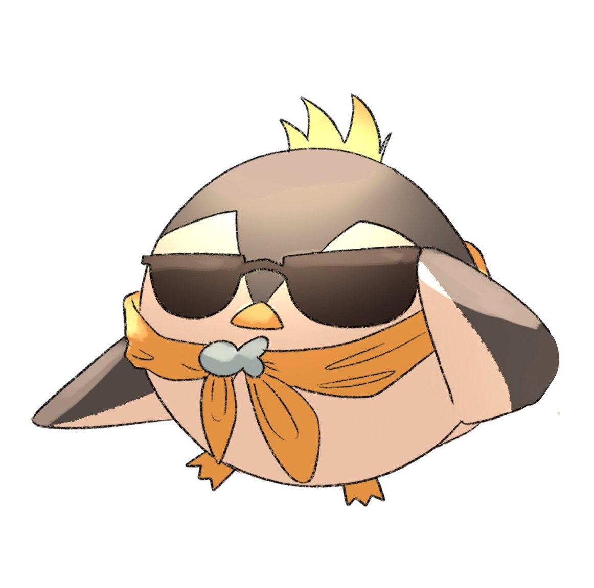

#  NijiTweetBot

[](/LICENSE)
[](https://github.com/Steeven9/NijiTweetBot/actions/workflows/docker-image.yml)


A simple Discord bot to fetch schedule-related Nijisanji tweets to
feed our [schedule](https://nijien.vercel.app).

Profile picture by the amazing [L_YTH](https://twitter.com/lost_yth)!

## Setup

To install the requirements, run `pip install --no-cache-dir -r requirements.txt`.

You will need a Twitter API Bearer token and the Discord bot token.

Set the following environment variables with the two respective values:

```bash
TWITTER_BEARER_TOKEN
NIJITWEETBOT_TOKEN
```

You will also need to set the `NIJITWEETBOT_CHANNEL` variable with the
Discord channel ID where you want the messages to be sent to.

Finally, run `python main.py`.

## Usage

The bot automatically sends new tweets in the specified channel every 60 seconds
(the timeout is configurable in `main.py`). The query is configurable in the
`fetcher.py` file, while the watched users and keywords can be set in the `data.py` file.

Optionally you can also use `/nijitweets` to fetch and display new tweets manually.
If you don't see the slash command in your server, wait around one hour to allow it
to sync, or check that you invited the bot with the `applications.commands` scope.

The most recent tweet is saved each time so you won't see the same one twice;
by default the ID is written in the `config/nijitweetbot.ini` file
(configurable in `main.py` as well).

## Docker? Docker

Create a `.env` file with the environment variables above, then build or pull the image and run it:

`docker build . -t nijitweetbot` or `docker pull steeven9/nijitweetbot`

`docker run --name nijitweetbot --env-file .env nijitweetbot`
